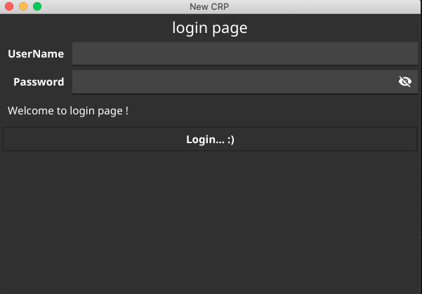

### loging page with 



### `Note `- 
```text
this is fixed for text/ entry label what ever all are fixed lenght..
```
### Reason - 
> we used here content `container.NewVBox`
```go
window.SetContent(
		container.NewVBox(
			title,
			form,
			status,
			widget.NewButton("Login... :)", func() {
				status.SetText("logine successfully :)")

			}),
		))
```        
## so now not work this command - `size & possition`
```go
entry.Resize(fyne.NewSize(250, 30)) 
entry.Move(fyne.NewPos(40, 50))  
```