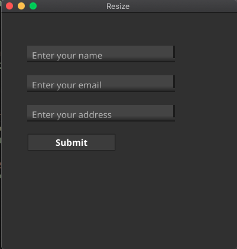

### loging page with 


### `Note `- 
```text
this is fixed for text/ entry label what ever all are fixed lenght..
```
### Reason - 
> we used here content `container.NewVBox`
```go
w.SetContent(
		container.NewVBox(
			)
```        
### so now not work this command - `size & possition`
```go
entry.Resize(fyne.NewSize(250, 30)) 
entry.Move(fyne.NewPos(40, 50))  
```
## How to work 
> use this on SetContent line
```go
w.SetContent(
        container.NewWithoutLayout(
	)
```

